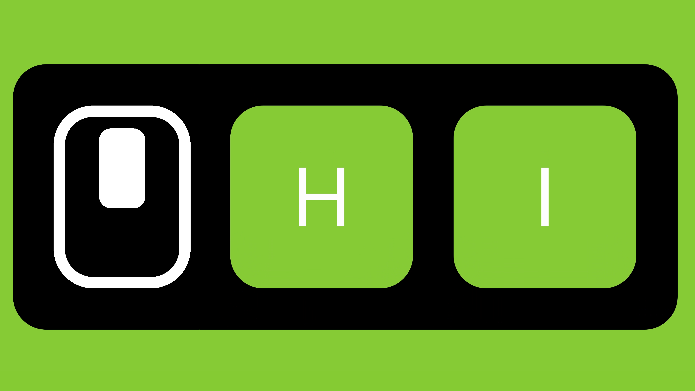

# KeyClickOverlay

*A small Windows app that displays keyboard and mouse input on screen with a flexible UI that can be freely positioned, resized, and customized.*

KeyClickOverlay was created for screen recordings, live demonstrations, tutorials, streaming, and classroom use. It works globally, capturing keyboard and mouse input even when another application has focus, making it ideal for these scenarios.

Most free alternatives restrict the overlay to predefined screen positions and fixed layouts. KeyClickOverlay was built to remove those limitations by giving you complete freedom over where the overlay appears, how large it is, and how it fits into your recording or teaching setup.

Freely position the overlay anywhere on screen, resize it precisely, create multiple presets, and make small visual adjustments such as colors, opacity, and background styling to match your workflow.

## Installation

Install KeyClickOverlay from the **[Microsoft Store](https://apps.microsoft.com/detail/9ntfch58xzzs?hl=en-US&gl=NL)**.

## Requirements

- Windows 11 (64-bit)
- Windows 10 compatibility has not been verified.

## Highlights

- **Freely position and resize the overlay**  
  Place the overlay anywhere on screen and resize it to exactly the dimensions you need.

- **Global keyboard and mouse input capture**  
  Visualize keyboard and mouse input even when another application has focus.

- **Transparent Mode**  
  Make the overlay click-through while keeping it visible on top of your applications.

- **Customizable appearance**  
  Adjust colors, opacity, background, padding, and corner radius to match your recording setup.

- **Up to 10 presets**   
  Save up to 10 different layouts, positions, sizes, and visual styles, and switch between them instantly.

- **Multi-monitor support**  
  Easily move the overlay between monitors and include the selected monitor in your presets.

- **Taskbar thumbnail controls**  
  Quickly toggle Transparent Mode, clear the key display, or close the application directly from the Windows taskbar.

## Preview

*Screenshots will be added soon.*

## Documentation

The complete documentation is available on the **[VertexCuriosity website](https://vertexcuriosity.com/addons-and-apps/apps/keyclickoverlay)**.

Topics include:

- User Guide
- Configuration
- Keyboard Shortcuts
- Frequently Asked Questions

## Video Tutorial

A complete walkthrough of KeyClickOverlay, including installation, configuration, and customization, will be available on YouTube.

*Coming soon.*

## Contributing

Contributions are welcome!

If you encounter a bug, have a feature request, or would like to contribute code, please open an issue or read the [Contributing Guidelines](CONTRIBUTING.md).

## License

KeyClickOverlay is licensed under the GPL-3.0-or-later.

See the [LICENSE](LICENSE) file for details.
